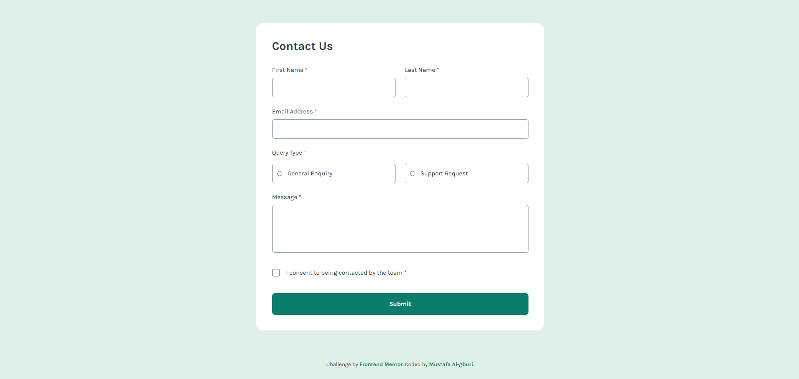

# Frontend Mentor - Contact form solution

This is a solution to the [Contact form challenge on Frontend Mentor](https://www.frontendmentor.io/challenges/contact-form--G-hYlqKJj). Frontend Mentor challenges help you improve your coding skills by building realistic projects. 

## Table of contents

- [Overview](#overview)
  - [The challenge](#the-challenge)
  - [Screenshot](#screenshot)
  - [Links](#links)
- [My process](#my-process)
  - [Built with](#built-with)
  - [What I learned](#what-i-learned)
  - [Continued development](#continued-development)
  - [Useful resources](#useful-resources)
- [Author](#author)

## Overview

### The challenge

Users should be able to:

- Complete the form and see a success toast message upon successful submission
- Receive form validation messages if:
  - A required field has been missed
  - The email address is not formatted correctly
- Complete the form only using their keyboard
- Have inputs, error messages, and the success message announced on their screen reader
- View the optimal layout for the interface depending on their device's screen size
- See hover and focus states for all interactive elements on the page

### Screenshot



### Links

- Solution URL: [https://github.com/mustadotdev/frontend-mentor-contact-form](https://github.com/mustadotdev/frontend-mentor-contact-form)
- Live Site URL: [https://mustadotdev.github.io/frontend-mentor-contact-form/](https://mustadotdev.github.io/frontend-mentor-contact-form/)

## My process

### Built with

- Semantic HTML5 markup
- CSS Flexbox
- Mobile-first workflow
- [Tailwind CSS v4](https://tailwindcss.com/) - Utility-first CSS framework (via CDN)
- Vanilla JavaScript - For custom form validation and DOM manipulation

### What I learned

Because the official Figma design files are locked for free users on Frontend Mentor, I didn't have access to the exact pixel measurements, padding, or typography details. I managed to replicate the design as closely as possible by relying on my own eye, browser developer tools, and online resources to match the static JPEG previews.

This project was a massive learning curve for getting used to Tailwind CSS and moving away from traditional CSS stylesheets. Initially, applying multiple classes to every single input felt repetitive, but learning VS Code shortcuts (like `Alt + Click` and `Ctrl + D` for multi-cursor editing) completely changed my workflow.

A major highlight was learning how to style parent containers based on the state of their children using Tailwind's `has-[]` modifier. I used this to dynamically change the background and border color of the custom radio button wrappers without needing any JavaScript:

```html
<!-- The wrapper dynamically turns green when the radio input inside it is checked -->
<div class="border border-grey-500 rounded-md p-3 w-full flex items-center gap-3 cursor-pointer hover:border-green-600 has-[:checked]:bg-green-200 has-[:checked]:border-green-600">
  <input type="radio" id="general-enquiry" name="query-type" value="general" class="accent-green-600 w-4 h-4 cursor-pointer">
  <label for="general-enquiry" class="cursor-pointer w-full">General Enquiry</label>
</div>